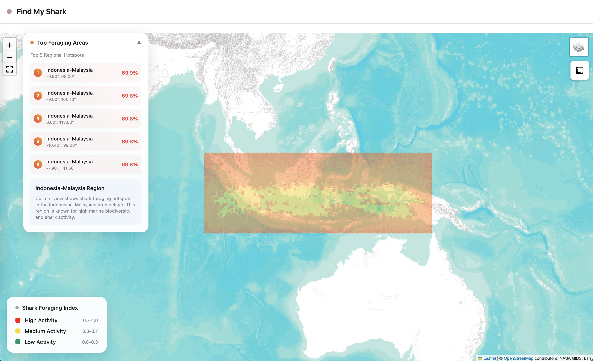

# 🦈 Find My Shark - NASA Space Apps 2025 Hackathon

# Galactic Impact Winner!



A modular Python Shark Conservation GeoSpatial ML Tool that ingests NASA satellite data (PACE, MODIS-Aqua, SWOT) to generate a Foraging Opportunity Index (FOI) for shark foraging hotspots. The system ensures temporal alignment across datasets and visualizes hotspots as overlays on NASA GIBS MODIS True-Color imagery.

Find My Shark helps combat illegal exploitation and shark finning!

## 🌟 Features

- **Multi-Satellite Data Integration**: Harmonizes PACE, MODIS-Aqua, and SWOT datasets
- **Temporal Alignment**: Ensures synchronous coverage across all satellite sources
- **Oceanographic Analysis**: Computes derived fields (EKE, vorticity, SST gradient, euphotic depth)
- **Foraging Opportunity Index**: Scientifically-grounded model for shark foraging hotspots
- **Interactive Visualization**: NASA GIBS MODIS True Color basemap with FOI overlays
- **Conservation Priority Surface**: Optional integration with fishing effort data
- **Modular Architecture**: Hackathon-ready, extensible design

## 🗺️ Region of Interest

**Coral Triangle (Indonesia-Malaysia)**
- **Longitude**: 94°E – 142°E
- **Latitude**: 11°S – 6°N
- **Target Species**: Tropical pelagic sharks (silky, hammerhead, oceanic whitetip)
- **Preferred Temperature**: 26°C ± 2.5°C

## 🛰️ Data Sources

| Dataset | Product | Purpose |
|---------|---------|---------|
| **PACE Ocean Color** | L2/L3B_OC_OCI | Chlorophyll-a, plankton type |
| **MODIS-Aqua Ocean Color** | MODISA_L3m_CHL | Long-term chlorophyll baseline |
| **MODIS SST** | MODIS_Aqua_L3m_SST_MidIR_8Day | Surface temperature |
| **SWOT SSH** | Ocean_2.0_L2_LR_SSH | Sea surface height for eddy detection |
| **Kd490** | MODISA_L3m_KD490 | Diffuse attenuation for euphotic depth |

## 🧮 Mathematical Model

The Foraging Opportunity Index (FOI) combines multiple oceanographic factors:

### Input Variables
- **SSH(x,y,t)**: Sea surface height (SWOT)
- **SST(x,y,t)**: Sea surface temperature (MODIS/PACE)
- **Chl(x,y,t)**: Chlorophyll-a concentration (PACE/MODIS)
- **Kd490(x,y,t)**: Diffuse attenuation coefficient (MODIS/PACE)

### Derived Variables
- **Geostrophic velocities**: u_g = -(g/f)∂SSH/∂y, v_g = (g/f)∂SSH/∂x
- **Eddy Kinetic Energy**: EKE = 0.5·(u_g'² + v_g'²)
- **Relative vorticity**: ζ = ∂v_g/∂x - ∂u_g/∂y
- **SST gradient**: |∇SST| = √((∂SST/∂x)² + (∂SST/∂y)²)
- **Euphotic depth**: Z_eu = 4.6/Kd490

### FOI Components
1. **Thermal Suitability**: ST = exp(-(T-T_pref)²/(2σ_T²))
2. **Eddy Relief**: ST,eff = 1 - (1-ST)(1-α·EKE~)
3. **Productivity Proxy**: P = log(1+Chl)
4. **Twilight Access**: A_tw = β₁·Z~_eu + β₂·EKE~
5. **Front Strength**: F_front = |∇SST|~

### Final FOI
**η = b₀ + b₁·ST,eff + b₂·P~ + b₃·A_tw + b₄·F_front**

**FOI = 1/(1 + e^(-η))**

## 🚀 Quick Start

### 1. Installation

```bash
# Clone the repository
git clone https://github.com/your-username/spaceApps2025.git
cd spaceApps2025

# Install dependencies
pip install -r requirements.txt

# Create required directories
mkdir -p data/{inputs,outputs} logs
```

### 2. Basic Usage

```bash
# Run with default parameters (Coral Triangle, March 2025)
python scripts/run_predict.py

# Run with custom date range
python scripts/run_predict.py --start-date 2025-03-01 --end-date 2025-03-14

# Run with custom region
python scripts/run_predict.py --bbox 94.0 -11.0 142.0 6.0

# Generate visualizations only
python scripts/run_predict.py --visualize-only --date 20250301
```

### 3. Python API Usage

```python
from foi_backend.shark_hotspots import predictor, visualize_hotspots

# Compute FOI map
foi, summary = predictor.compute_foi_map("2025-03-01", "2025-03-14")

# Generate interactive dashboard
dashboard_path = visualize_hotspots.generate_dashboard(foi, date="2025-03-07")

# Create static snapshot
snapshot_path = visualize_hotspots.create_static_snapshot(foi, date="2025-03-07")
```

## 📁 Project Structure

```
foi_backend/
├── shark_hotspots/
│   ├── __init__.py
│   ├── config.yaml              # Configuration file
│   ├── data_loader.py           # NASA satellite data loading
│   ├── harmonize.py             # Temporal/spatial harmonization
│   ├── derived_fields.py        # Oceanographic derived fields
│   ├── normalization.py         # Robust percentile scaling
│   ├── model_core.py            # FOI mathematical model
│   ├── predictor.py             # Main orchestration
│   └── visualize_hotspots.py   # Interactive visualizations
├── data/
│   ├── inputs/                  # Raw satellite data
│   └── outputs/
│       ├── foi/YYYYMMDD/        # FOI outputs
│       └── cps/YYYYMMDD/        # CPS outputs
├── scripts/
│   └── run_predict.py           # Main execution script
└── logs/                        # Log files
```

## ⚙️ Configuration

The system uses `config.yaml` for configuration:

```yaml
# Temporal Configuration
data:
  start_date: "2025-03-01"
  end_date: "2025-03-14"
  composite_days: 7

# Region of Interest
region:
  name: "coral_triangle"
  bbox: [94.0, -11.0, 142.0, 6.0]

# Model Parameters
model:
  coefficients:
    b0: 0.0   # intercept
    b1: 0.3   # thermal suitability
    b2: 0.25  # productivity proxy
    b3: 0.25  # twilight access
    b4: 0.2   # front strength
```

## 📊 Output Files

### FOI Maps
- `foi_map.nc`: NetCDF file with FOI data
- `foi_summary.json`: Statistical summary
- `metadata.json`: Processing metadata

### Visualizations
- `foi_dashboard.html`: Interactive Folium map
- `foi_snapshot.png`: Static PNG image
- `foi_statistics.png`: Statistical plots

### Conservation Priority Surface (Optional)
- `cps_map.nc`: CPS NetCDF file
- `cps_summary.json`: CPS statistics

## 🎯 Command Line Options

```bash
python scripts/run_predict.py [OPTIONS]

Options:
  --start-date DATE          Start date (YYYY-MM-DD)
  --end-date DATE            End date (YYYY-MM-DD)
  --bbox LON_MIN LAT_MIN LON_MAX LAT_MAX
                            Bounding box coordinates
  --config FILE              Configuration file path
  --output-dir DIR           Output directory
  --no-save                  Don't save output files
  --visualize-only           Only generate visualizations
  --date YYYYMMDD            Date for visualization-only mode
  --no-interactive           Skip interactive dashboard
  --no-static                Skip static snapshot
  --compute-cps              Also compute Conservation Priority Surface
  --verbose                  Enable verbose logging
```

## 🔬 Scientific Background

### Temporal Alignment Strategy
- **Composite Time Window**: 2025-03-01 → 2025-03-14 (7-14 day rolling mean)
- **Rationale**: 
  - PACE (launched 2024) provides valid data
  - MODIS-Aqua offers 8-day composite layers
  - SWOT completes one 21-day cycle → near-synchronous coverage

### Model Validation
- **Value Range**: FOI ∈ [0, 1]
- **Spatial Coverage**: >10% valid pixels required
- **Hotspot Thresholds**: Low (0.3), Medium (0.5), High (0.7)

### Data Quality
- **Robust Normalization**: 5-95 percentile scaling
- **Missing Data**: NaN handling with interpolation
- **Temporal Compositing**: Rolling window averaging

## 🌐 Interactive Visualization

The system generates interactive maps using:
- **NASA GIBS MODIS True Color**: Basemap imagery
- **Folium**: Interactive mapping framework
- **FOI Overlay**: Semi-transparent hotspot visualization
- **Layer Controls**: Toggle between different data layers
- **Fullscreen Support**: Presentation-ready interface

## 🚀 Future Extensions

- **FastAPI Endpoints**: `/predict` and `/hotspots` REST API
- **Time-lapse Visualization**: 7-day rolling FOI animations
- **Smart Shark Tag Integration**: Live updates from tagged sharks
- **Machine Learning**: Logistic coefficients from tagged shark data
- **Real-time Processing**: Live satellite data ingestion

## 🧪 Testing

```bash
# Run tests
pytest tests/

# Run with coverage
pytest --cov=foi_backend tests/

# Test individual modules
python -m foi_backend.shark_hotspots.data_loader
python -m foi_backend.shark_hotspots.harmonize
python -m foi_backend.shark_hotspots.derived_fields
python -m foi_backend.shark_hotspots.normalization
python -m foi_backend.shark_hotspots.model_core
python -m foi_backend.shark_hotspots.predictor
python -m foi_backend.shark_hotspots.visualize_hotspots
```

## 📝 Logging

The system provides comprehensive logging:
- **File Logging**: `logs/shark_hotspots.log`
- **Console Output**: Real-time progress updates
- **Processing Status**: Detailed workflow information
- **Error Handling**: Graceful failure with informative messages

## 🤝 Contributing

1. Fork the repository
2. Create a feature branch
3. Make your changes
4. Add tests
5. Submit a pull request

## 📄 License

This project is developed for NASA Space Apps 2025. Please refer to the competition guidelines for usage terms.

## 🙏 Acknowledgments

- **NASA**: Satellite data and GIBS imagery
- **Space Apps 2025**: Competition platform
- **Indonesia-Malaysia Team**: Development team
- **Scientific Community**: Oceanographic research foundations

## 📞 Support

For questions or issues:
- **GitHub Issues**: Report bugs and feature requests
- **Documentation**: Check this README and inline code comments
- **Logs**: Check `logs/shark_hotspots.log` for detailed information

---

**🦈 Sharks from Space - Protecting Ocean Predators Through Satellite Technology 🛰️**
